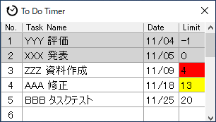
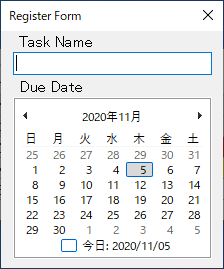
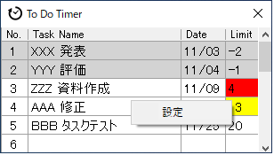
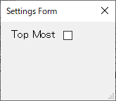

# To Do Timer

### タスクの締め切りまでの日数を表示する Windows アプリです。

 

## 特徴

### <u>1. タスクの締め切り日数を表示</u>
※黄色：締め切り2週間以内、赤：締め切り1週間以内、グレー：締め切り以降
### <u>2. タスクの表示順を締め切り順で自動ソート</u>
### <u>3. シンプルな操作性</u>
### <u>4. ミニマムなウィンドウサイズ</u>
 

## インストール＆ソフト起動方法

1. to_do_timer_x.x.xフォルダをPC内の任意の場所（ダウンロードフォルダなど）に置きます。
1. フォルダ内の to_do_timer.exeをダブルクリックしてソフトを起動します。
また、ショートカットファイルを使用することで任意の場所からソフトを起動できます。
 

## 操作方法

* 新規タスク登録  
Task Nameが空の行をダブルクリックするとタスク登録画面が表示されます。 
 タスク名を入力し、締め切り日を決定してからタスク登録画面を閉じるとタスクが新規登録されます。 
タスクは最大20個まで登録することができます。

* タスク編集  
編集したいタスクをダブルクリックするとタスク登録画面が表示されます。
タスク名と、締め切り日を編集しタスク登録画面を閉じるとタスクの内容が更新されます。

* タスク削除  
削除したいタスクをダブルクリックするとタスク登録画面が表示されます。
タスク名を空にしてからタスク登録画面を閉じるとタスクが削除されます。

* 画面フロート設定  
タスクが表示されている画面上で右クリックし、"設定"メニューをクリックすると設定画面が表示されます。 
 
Top Mostにチェックを入れて画面を閉じて、ソフトを再起動すると画面がフロートします。

